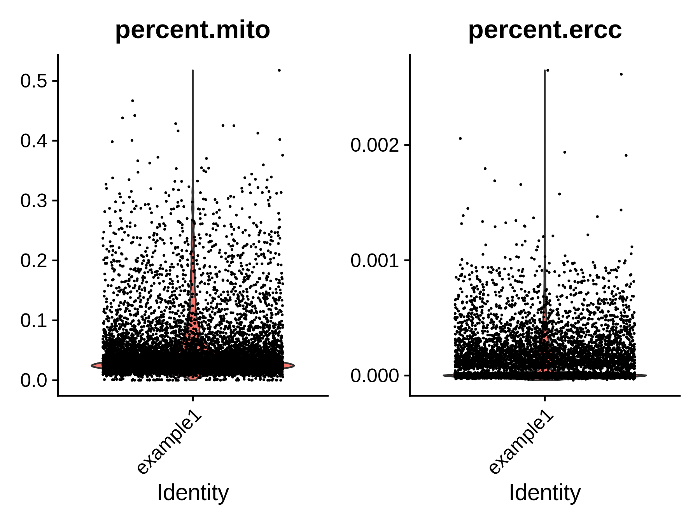
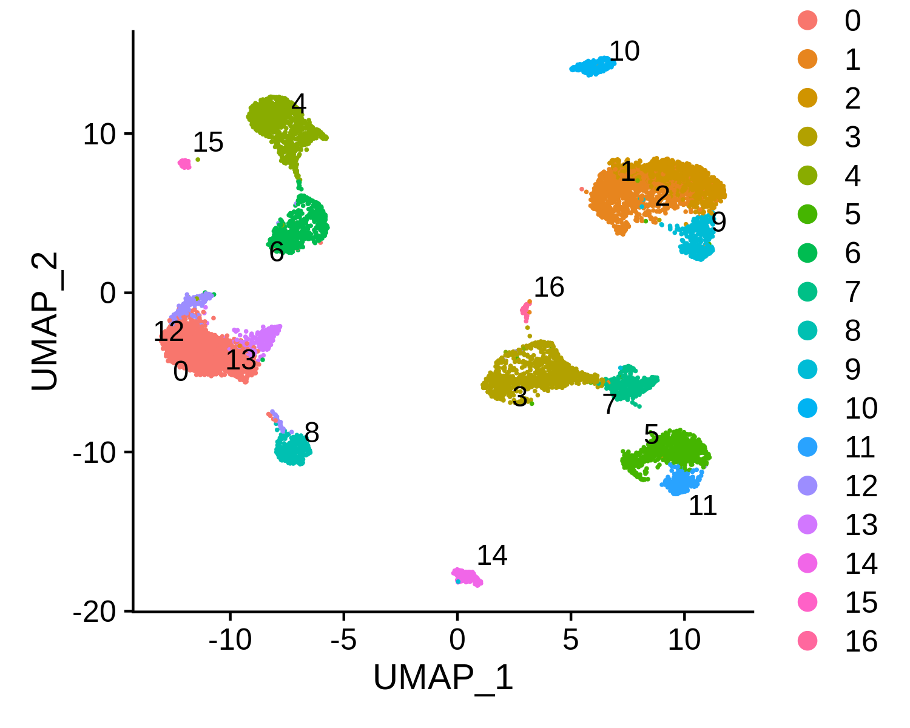
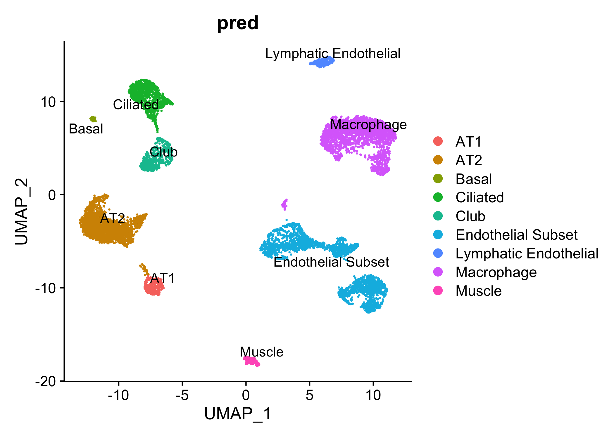

# Examples

Here we afford two examples to show you how to run SELINA step by step.

## Normal mode

This example shows how to predict for data from normal tissues.

### 1. Data

The data used in this vignette are organized as the following directory tree shows.

```
├── query_data
│   └── GSE139534_Lung-Adult_10462_expr.txt
├── reference_data
│   ├── GSE123405_Lung-Adult_7786_expr.txt
│   ├── GSE123405_Lung-Adult_7786_meta.txt
│   ├── GSE130148_Lung-Adult_2306_expr.txt
│   ├── GSE130148_Lung-Adult_2306_meta.txt
│   ├── GSE134355_Lung-Adult_5672_expr.txt
│   ├── GSE134355_Lung-Adult_5672_meta.txt
│   ├── GSE134355_Lung-Adult_8426_expr.txt
│   ├── GSE134355_Lung-Adult_8426_meta.txt
│   ├── GSE134355_Lung-Adult_9113_expr.txt
│   ├── GSE134355_Lung-Adult_9113_meta.txt
│   ├── GSE146981_Lung-Adult_27015_expr.txt
│   └── GSE146981_Lung-Adult_27015_meta.txt
└── res
```

The query data used here is from [mTORC1 activation in lung mesenchyme drives sex- and age-dependent pulmonary structure and function decline](https://www.nature.com/articles/s41467-020-18979-4). The citation papers of the reference data are listed in the following table.

|          Dataset           |                                                                                                        Study                                                                                                        |
| :------------------------: | :-----------------------------------------------------------------------------------------------------------------------------------------------------------------------------------------------------------------: |
| GSE123405_Lung-Adult_7786  |               [Cell-specific expression of lung disease risk-related genes in the human small airway epithelium](https://respiratory-research.biomedcentral.com/articles/10.1186/s12931-020-01442-9)                |
| GSE130148_Lung-Adult_2306  |                                     [A cellular census of human lungs identifies novel cell states in health and in asthma](https://www.nature.com/articles/s41591-019-0468-5)                                      |
| GSE134355_Lung-Adult_5672  |                                                  [Construction of a human cell landscape at single-cell level](https://www.nature.com/articles/s41586-020-2157-4)                                                   |
| GSE134355_Lung-Adult_8426  |                                                  [Construction of a human cell landscape at single-cell level](https://www.nature.com/articles/s41586-020-2157-4)                                                   |
| GSE134355_Lung-Adult_9113  |                                                  [Construction of a human cell landscape at single-cell level](https://www.nature.com/articles/s41586-020-2157-4)                                                   |
| GSE146981_Lung-Adult_27015 | [Senescence of Alveolar Type 2 Cells Drives Progressive Pulmonary Fibrosis](https://www.atsjournals.org/doi/10.1164/rccm.202004-1274OC?url_ver=Z39.88-2003&rfr_id=ori:rid:crossref.org&rfr_dat=cr_pub%20%200pubmed) |

Specifically, the reference datasets are stored in the reference_data folder, and for each dataset there are two files that will be used in the pre-training stage; one containing `expr` in name provides the expression profile of each dataset, and the file with `meta` presents the cell type and sequencing platform of each cell. Here we take GSE123405_Lung-Adult_7786 as an example to show you the detailed information.

```
GSE123405_Lung-Adult_7786_expr.txt
```

```
Gene GSM3502715@GTTAGCTTAATT GSM3502715@TCCCCTCTTCGC GSM3502715@TATTGTTTTACN GSM3502715@GACTTATTTATA
A2M 0 0 0 0
A4GALT 1 2 1 0
AAAS 0 0 3 0
AACS 0 2 0 0
AADAC 0 0 0 0
```

```
GSE123405_Lung-Adult_7786_meta.txt
```

```
Celltype Platform
Club Drop-seq
Club Drop-seq
Club Drop-seq
Ciliated Drop-seq
```

### 2. Preprocess of query data

The following command is to normalize expression profile, convert the genes to version hg38 and symbol names, perform dimension reduction and clustering for your data. SELINA supports 3 formats of input: `plain`,`h5` and `mtx`. The gene by cell matrix is in plain format.

```
selina preprocess --format plain --matrix ./query_data/GSE139534_Lung-Adult_10462_expr.txt --separator tab --gene-idtype symbol --assembly GRCh38 --count-cutoff 1000 --gene-cutoff 500 --cell-cutoff 10 --mito --mito-cutoff 0.2 --variable-genes 2000 --npcs 30 --cluster-res 0.6 --directory ./res/preprocess/example1 --outprefix example1
```

```
Check the mitochondria and spike-in percentage ...
Normalization and identify variable genes ...
Performing log-normalization
0%   10   20   30   40   50   60   70   80   90   100%
[----|----|----|----|----|----|----|----|----|----|
**************************************************|
Calculating gene variances
0%   10   20   30   40   50   60   70   80   90   100%
[----|----|----|----|----|----|----|----|----|----|
**************************************************|
Calculating feature variances of standardized and clipped values
0%   10   20   30   40   50   60   70   80   90   100%
[----|----|----|----|----|----|----|----|----|----|
**************************************************|
Regressing out nCount_RNA, percent.mito, percent.ercc
  |======================================================================| 100%
Centering and scaling data matrix
  |======================================================================| 100%
PCA analysis ...
PC_ 1
Positive:  SLPI, WFDC2, MUC1, KRT19, CXCL17, FXYD3, SFTPB, CLDN4, AGR3, ELF3
	   HOPX, SFTA2, PRDX5, KRT8, KRT18, MGST1, SLC34A2, EPCAM, TSTD1, PIGR
	   SFTA3, AGR2, SELENBP1, FOLR1, SQLE, S100A14, CYB5A, SMIM22, DHCR24, NAPSA
Negative:  C1QC, MARCO, ALOX5AP, TYROBP, MS4A7, C1QB, C1QA, FCER1G, CD68, FABP4
	   HLA-DQA1, LAPTM5, C1orf162, SPI1, AIF1, GRN, CD52, LYZ, CFD, CSTA
	   ACP5, GPNMB, CD53, OLR1, CD37, EVI2B, HLA-DRB1, APOE, FCGR3A, CAPG
PC_ 2
Positive:  TIMP3, SPARCL1, RAMP2, PRSS23, EPAS1, VWF, HYAL2, NPDC1, GIMAP7, PCAT19
	   MT1M, GNG11, PTPRB, GPX3, FAM107A, SLC9A3R2, TIMP1, TM4SF1, EGFL7, ID1
	   TINAGL1, VAMP5, CALCRL, SLCO2A1, TSPAN7, CAV1, MT2A, A2M, IFITM3, IFITM2
Negative:  SERPINA1, MGST1, FABP5, CTSH, FTL, APOC1, LGALS3BP, TSTD1, PRDX5, SDC4
	   NPC2, CES1, MUC1, SFTA2, CYB5A, CITED2, SCD, CXCL17, DCXR, DBI
	   CTSD, FTH1, HOPX, SLC34A2, SFTPB, FBP1, NAPSA, SFTA3, SFTPD, FXYD3
PC_ 3
Positive:  NAPSA, SFTPD, SFTPB, SFTA2, PEBP4, HOPX, S100A14, ABCA3, FABP5, SOD3
	   LAMP3, LRRK2, LPCAT1, DCXR, FASN, MFSD2A, SDR16C5, SLC39A8, SFTA3, SFN
	   C16orf89, WIF1, CSF3R, TMEM97, NPC2, ALPL, C3, MUC1, ZNF385B, C4BPA
Negative:  FAM183A, C9orf24, C20orf85, C1orf194, CAPS, C9orf116, DYNLRB2, TSPAN1, ZMYND10, C5orf49
	   PIFO, TPPP3, DNAAF1, CCDC146, TCTEX1D2, ROPN1L, MORN2, C12orf75, WDR54, ODF3B
	   DRC3, FAM216B, FAM229B, MNS1, NME5, DNALI1, CCDC170, CETN2, FOXJ1, DPCD
PC_ 4
Positive:  NPC2, WIF1, CTSH, LAMP3, SERPINA1, MFSD2A, LRRK2, TFPI, HHIP-AS1, DBI
	   CA2, TMEM97, CEBPD, CSF3R, HHIP, ARMC9, SOCS3, ZNF385B, MID1IP1, SFTPD
	   ABCA3, HMGCS1, FMO5, C4BPA, FABP5, SDR16C5, AGPAT2, TXNIP, ACAT2, FASN
Negative:  CEACAM6, AGER, FMO2, SCEL, SPOCK2, RTKN2, KLK11, MYL9, KRT7, CD55
	   GGT1, ABCA7, GPRC5A, SEMA3B, C19orf33, TNNC1, TACSTD2, CLIC5, COL12A1, ANKRD29
	   RAB11FIP1, SCNN1B, CAV1, PDPN, ANOS1, CRYAB, SCGB1A1, IL32, ADIRF, NCKAP5
PC_ 5
Positive:  IL32, AGER, ACTB, PLP2, TNFRSF12A, MYL9, S100A10, PFN1, SLC39A8, GGT1
	   SPOCK2, RTKN2, SCEL, PLS3, ABCA7, CAV1, TUBA1B, TNNC1, PEBP4, MSN
	   EMP2, LDHA, CFL1, ANKRD29, TAGLN, TSPAN13, EIF5A, LGALS1, ATP1B3, TUBA1C
Negative:  SCGB1A1, SCGB3A1, BPIFB1, TMEM45A, LCN2, TSPAN8, CYP2F1, RHOV, CP, KLK11
	   SERPINF1, PIGR, KIAA1324, ADAM28, SAA1, MMP7, CXCL6, HES1, MDK, AKR1C1
	   LTF, GSTA1, GDF15, EGR1, WFDC2, CLU, PLK2, MUC5B, CYP2J2, AQP5
UMAP analysis ...
Warning: The default method for RunUMAP has changed from calling Python UMAP via reticulate to the R-native UWOT using the cosine metric
To use Python UMAP via reticulate, set umap.method to 'umap-learn' and metric to 'correlation'
This message will be shown once per session
12:57:38 UMAP embedding parameters a = 0.9922 b = 1.112
12:57:38 Read 9791 rows and found 16 numeric columns
12:57:38 Using Annoy for neighbor search, n_neighbors = 30
12:57:38 Building Annoy index with metric = cosine, n_trees = 50
0%   10   20   30   40   50   60   70   80   90   100%
[----|----|----|----|----|----|----|----|----|----|
**************************************************|
12:57:39 Writing NN index file to temp file /tmp/Rtmpip3JcA/file6f24227f7445
12:57:39 Searching Annoy index using 1 thread, search_k = 3000
12:57:41 Annoy recall = 100%
12:57:41 Commencing smooth kNN distance calibration using 1 thread
12:57:42 Initializing from normalized Laplacian + noise
12:57:42 Commencing optimization for 500 epochs, with 414120 positive edges
0%   10   20   30   40   50   60   70   80   90   100%
[----|----|----|----|----|----|----|----|----|----|
**************************************************|
12:57:52 Optimization finished
Computing nearest neighbor graph
Computing SNN
Modularity Optimizer version 1.3.0 by Ludo Waltman and Nees Jan van Eck

Number of nodes: 9791
Number of edges: 343406

Running Louvain algorithm...
0%   10   20   30   40   50   60   70   80   90   100%
[----|----|----|----|----|----|----|----|----|----|
**************************************************|
Maximum modularity in 10 random starts: 0.9203
Number of communities: 17
Elapsed time: 1 seconds
```

Running the command shown above will output five files in the res/preprocess/example1 folder.

- `1. example1.spikein.png` : boxplots indicating the percentage of mitochondria or spiked in genes, each dot represents one cell (only generated when the --mito argument is included in the command)
  

- `2. query_res.rds` : a seurat object with gene expression profile and clustering result

```
An object of class Seurat
17547 features across 10453 samples within 1 assay
Active assay: RNA (17547 features, 2000 variable features)
2 dimensional reductions calculated: pca, umap
```

- `3. query_expr.txt` : expression matrix of query data for the prediction step, the first column stores genes and the following columns store expression of all cells

```
Gene GSM4143262@AAACCTGCATCAGTCA-1 GSM4143262@AAACCTGTCGGGAGTA-1 GSM4143262@AAAGTAGTCGGAATCT-1 GSM4143262@AACCATGCACGACGAA-1
<chr> <dbl> <dbl> <dbl> <dbl>
AL669831.5 0 0 0 0
FAM87B 0 0 0 0
LINC00115 0 0 0 0
FAM41C 0 0 0 0
AL645608.1 0 0 0 0
```

- `4. example1_cluster.png` : umap plot with cluster labels, each dot represents one cell
  

- `5. example1_cluster_DiffGenes.tsv` : matrix representing the differentially expressed genes for each cluster

```
p_val	avg_logFC	pct.1	pct.2	p_val_adj	cluster	gene
0	2.63182468831083	0.998	0.221	0	0	NAPSA
0	2.33786003142406	0.995	0.149	0	0	SFTPD
0	2.11217135163329	0.999	0.505	0	0	SFTPB
0	1.99568727012072	0.999	0.229	0	0	SFTA2
0	1.88704218078235	0.989	0.559	0	0	CTSH
0	1.83095405292494	0.974	0.121	0	0	PEBP4
0	1.78263895889793	0.998	0.751	0	0	NPC2
0	1.69288971193484	0.984	0.21	0	0	CXCL17
0	1.69264322023986	0.875	0.084	0	0	WIF1
```

### 3. Train

This step is to train a model using the reference data listed above.

```
selina train --path-in ./reference_data/ --path-out ./res/pre-train/ --outprefix  pre-trained
```

```
Loading data
100% |██████████████████████████████████████████████████| Reading data [done]
100% |██████████████████████████████████████████████████| Reading data [done]
100% |██████████████████████████████████████████████████| Reading data [done]
100% |██████████████████████████████████████████████████| Reading data [done]
100% |██████████████████████████████████████████████████| Reading data [done]
100% |██████████████████████████████████████████████████| Reading data [done]
Begin training
100%|███████████████████████████████████████████| 50/50 [12:06<00:00, 14.52s/it]
Finish Training
All done
```

In this step, two output files will be generated in the res/pre-train folder.

- `1. pre-trained_params.pt` : a file containing all parameters of the trained model

- `2. pre-trained_meta.pkl` : a file containing the cell types and genes of the reference data

```
with open('res/pre-trained_meta.pkl','rb') as f:
meta = pickle.load(f)

#genes
meta['genes'][1:5]
array(['A4GALT', 'AAAS', 'AACS', 'AADAC'], dtype='<U12')

#cell types
meta['celltypes'].keys()
dict_keys(['Mucous', 'CD8T', 'Fibroblast', 'Macrophage', 'Chondrocyte', 'DC', 'AT2', 'Endothelial_lv3', 'NK', 'Neutrophil', 'Alveolar Bipotent', 'AT1', 'Lymphatic Endothelial', 'Muscle', 'Mast', 'Secretory Epithelial', 'Club', 'Basal', 'Alveolar Bipotent Progenitor', 'Goblet', 'CD4T', 'Megakaryocyte', 'Intermediate(Club-Basal)', 'Ionocyte', 'B', 'Neuroendocrine', 'Ciliated', 'Monocyte'])
```

### 4. Predict

Here you can choose to use our pre-trained models (available on [SELINA models](https://github.com/SELINA-team/SELINA-reference/tree/main/Normal)) or the model trained by yourself to annotate the query data.

```
selina predict --query-expr ./res/preprocess/example1/example1_expr.txt  --model ./res/pre-train/pre-trained_params.pt --seurat ./res/preprocess/example1/example1_res.rds --prob-cutoff 0.9 --path-out ./res/predict/example1 --outprefix example1
```

```
Loading data
100% |██████████████████████████████████████████████████| Reading data [done]
Fine-tuning1
100%|███████████████████████████████████████████| 50/50 [01:14<00:00,  1.48s/it]
Finish Tuning1
Fine-tuning2
100%|███████████████████████████████████████████| 10/10 [00:19<00:00,  1.95s/it]
Finish Tuning2
Finish Prediction
Begin downstream analysis
Loading required package: grid
Finish downstream analysis
```

This step will output four files in the res/predict/example1 folder.

- `1. example1_predictions.txt` : predicted cell type for each cell in the query data

```
Cell	Prediction	Cluster
GSM4143262@AAACCTGAGGCACATG-1	Macrophage	2
GSM4143262@AAACCTGAGGCATGTG-1	Endothelial Subset	3
GSM4143262@AAACCTGCAAGCGCTC-1	AT2	0
```

- `2. example1_probability.txt` : probability of cells predicted as each of the reference cell types

```
                                Lymphatic Endothelial	Mucous	Chondrocyte
GSM4143262@AAACCTGAGGCACATG-1	1.989979e-18	6.4412396e-29	2.1919232e-21
GSM4143262@AAACCTGAGGCATGTG-1	9.362227e-12	6.302373e-37	1.3874241e-22
GSM4143262@AAACCTGCAAGCGCTC-1	2.0353161e-38	2.5598576e-25	2.749134e-26
```

- `3. example1_pred.png` : umap plot with cell type annotations
  

- `4. example1_DiffGenes.tsv` : matrix representing the differentially expressed genes for each cell type, this file can be used to validate the annotation results

```
p_val	avg_logFC	pct.1	pct.2	p_val_adj	celltype	gene
0	4.34232194761814	0.997	0.071	0	AT1	AGER
0	2.77580098989602	0.916	0.108	0	AT1	CEACAM6
0	2.23244539235067	0.949	0.209	0	AT1	GPRC5A
```

## Disease mode

This example shows how to predict for data from tissues with diseases.

### 1. Data

The query data used here is one dataset with type II diabetes(T2D) from [Single-Cell Transcriptome Profiling of Human Pancreatic Islets in Health and Type 2 Diabetes](<https://www.cell.com/cell-metabolism/fulltext/S1550-4131(16)30436-3?_returnURL=https%3A%2F%2Flinkinghub.elsevier.com%2Fretrieve%2Fpii%2FS1550413116304363%3Fshowall%3Dtrue>) in mtx format. The model here used to predict is one pre-trained model that was trained on several published T2D datasets. Remember to include the `--disease` option in your comannd if you plan to train on your data.

The pre-trained models are paired files of which one stores genes, cell types and cell sources, and another one stores parameters of the model.

- `1. T2D_params.pt`

- `2. T2D_meta.pkl`

```
with open('T2D_meta.pkl','rb') as f:
    meta = pickle.load(f)

#genes
meta['genes'][1:5]
['LINC00352', 'DNAJC3-DT', 'UBAC2-AS1', 'LINC00543']

#cell types
meta['celltypes'].keys()
dict_keys(['Alpha', 'Stellate', 'Ductal', 'Endothelial', 'Beta', 'Epsilon', 'Delta', 'Acinar', 'Gamma'])

#cell sources
meta['cellsources'].keys()
dict_keys(['T2D', 'Normal'])
```

### 2. Preprocess of query data

```
selina preprocess --format mtx --matrix ./query_data/matrix.mtx --feature ./query_data/genes.tsv --gene-column 2 --barcode ./query_data/barcodes.tsv --gene-idtype symbol --assembly GRCh38 --count-cutoff 1000 --gene-cutoff 500 --cell-cutoff 10 --variable-genes 2000 --npcs 30 --cluster-res 0.6 --directory ./res/preprocess/example2/ --outprefix ./example2
```

This command will output four files that are similar to the results in example1 except for the `prefix.spikein.png` since the `--mito` option is not included in the command.

### 3. Predict

Here we use the [pre-trained model](https://github.com/SELINA-team/SELINA-reference/tree/main/Disease) provided by SELINA to predict for the T2D data, thus the pre-training step can be skipped. Note that the `--disease` argument is added in the following command.

```
selina predict --query-expr ./res/preprocess/example2/example2_expr.txt  --model ./res/pre-train/Lung_params.pt --seurat ./res/preprocess/example2/example2_res.rds  --prob-cutoff 0.9 --path-out ./res/predict/example2 --outprefix example2 --disease
```

In this step, five files will be generated in the res/predict/example2/ folder, four of which are similar to the results from example1, and the additional output file named `example2_cellsources.txt` contains cell source prediction results for each cell.

```
Cell	Prediction
ERR1630022	T2D
ERR1630035	Normal
ERR1630081	T2D
ERR1630098	T2D
ERR1630113	Normal
ERR1630122	Normal
```
