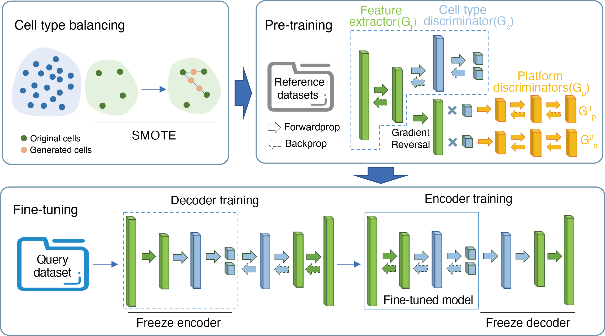

.. SELINA documentation master file, created by
   sphinx-quickstart on Sat Nov  6 10:34:40 2021.
   You can adapt this file completely to your liking, but it should at least
   contain the root `toctree` directive.

SELINA's documentation
=================================
SELINA is a deep learning-based framework for single-cell assignment with multiple references. The algorithm consists of three main steps: cell type balancing, pre-training and fine-tuning. The rare cell types in reference data are first oversampled using SMOTE(Synthetic Minority Oversampling Technique), and then the reference data is trained with a supervised deep learning framework using MADA(Multi-Adversarial Domain Adaptation). An autoencoder is subsequently used to fine-tune the parameters of the pre-trained model. Finally, the labels from reference data are transferred to the query data based on the fully-trained model. Along with the annotation algorithm, we also collected 136 datasets which were uniformly processed and curated to provide users with comprehensive pre-trained models.
Currently there are two modes in SELINA: normal mode for normal datasets prediction and disease mode for disease dataset prediction. The architecture and cost function of the disease mode is slightly different to the normal mode, please refer to our paper to get more clearly explained.

Usage
=====

.. toctree::
   :maxdepth: 4

   prepare

.. toctree::
   :maxdepth: 4

   run

.. toctree::
   :maxdepth: 4

   examples
   

